# Open5GS Network Management System (NMS)

[](https://www.gnu.org/licenses/agpl-3.0)
[](https://www.docker.com/)
[](https://open5gs.org/)
[](https://nodejs.org/)
[](https://reactjs.org/)

Web-based management system for Open5GS 5G Core and 4G EPC networks. Provides complete configuration management, real-time monitoring, subscriber provisioning, and network visualization through an intuitive interface. Please be aware this project is heavily AI-assisted. If you find any issues please let me know — I will fix them as fast as I can.

---

## 🎯 Overview

Open5GS NMS simplifies the management of Open5GS deployments by providing:

- **Complete Network Function Management** - Configure all 17 Open5GS network functions (5G Core + 4G EPC + SEPP roaming)
- **Visual Network Topology** - Interactive real-time visualization of your network infrastructure
- **Subscriber Management** - Full CRUD operations with SIM generator and auto-provisioning
- **Real-Time Monitoring** - Live service status, logs, and active session tracking
- **Safe Configuration** - Automatic backups, validation, and rollback on failure
- **5G Privacy (SUCI)** - Home network key management for subscription concealment
- **Authentication** - Session-based login protecting all pages and API endpoints
- **Voice & SMS** - Optional IMS/VoLTE core (alpha, not production-ready) and SGs-based SMS, both provisioned and managed from the UI
- **L3 Routing (FRR)** - Guided L2→L3 migration, EIGRP/OSPF/BGP support, and a from-source FRR reinstall path
- **End-to-End Testing** - Simulated 4G/5G test UEs (UE Validation) to verify attach/PDU/paging without a physical radio


---

## ✨ Key Features

### Authentication
- **Login required** — All pages and API endpoints are protected. A login form is shown automatically to unauthenticated users
- **Session persistence** — Sessions survive page refresh (24-hour lifetime by default, configurable)
- **Secure cookies** — HttpOnly, SameSite=lax; `Secure` flag enabled when behind HTTPS
- **First-run setup** — Admin account created automatically on first deploy (see [First Login](#first-login))
- **Brute force protection** — Login endpoint rate-limited to 10 attempts per 15 minutes per IP

### Metrics & Monitoring
- **Prometheus Integration** — Prometheus scrape config auto-generated and live-reloaded on every config apply. No manual `prometheus.yml` editing needed
- **Grafana Dashboards** — Pre-built Open5GS dashboard covering AMF, SMF, UPF, PCF, HSS, PCRF and process health. Grafana datasource auto-provisioned on first start
- **Metrics Endpoints Page** — Dual-mode editor: table view for individual NF address/port editing, or direct Prometheus scrape config YAML editing. Both views stay in sync
- **One-click access** — Prometheus and Grafana links directly in the Metrics page header

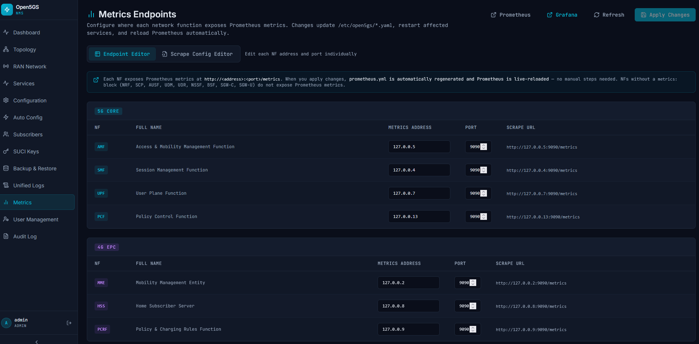

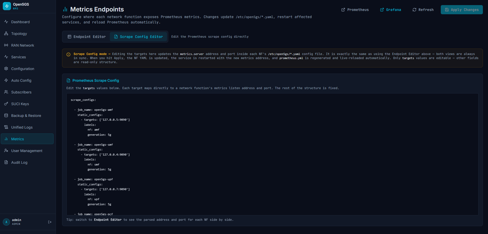

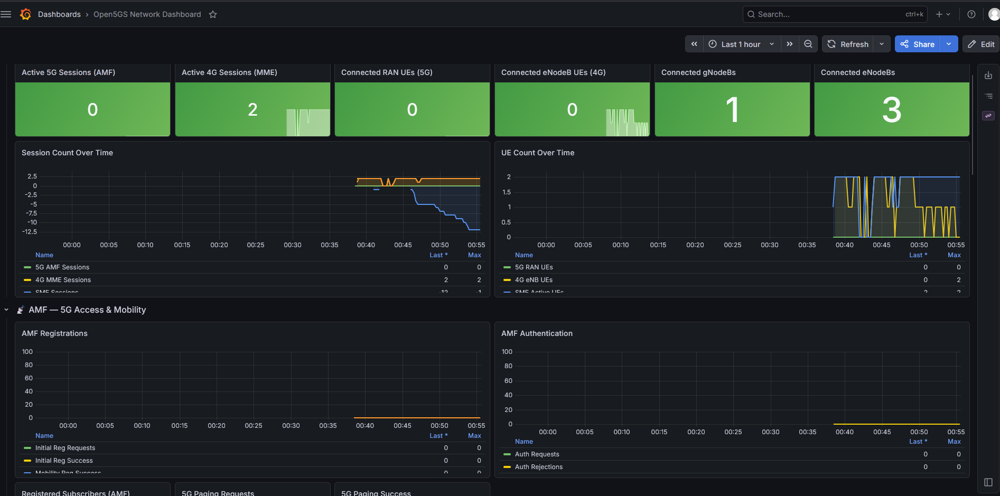

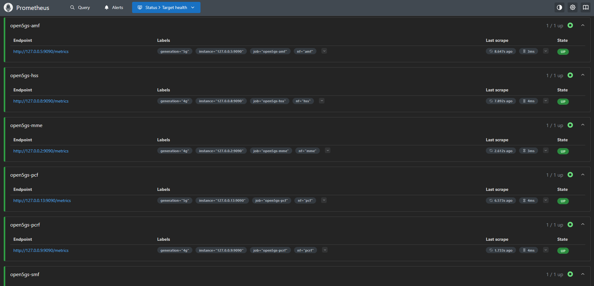

### Configuration Management
- **Dual Editor Modes** - Form-based editor with 150+ contextual tooltips OR Monaco YAML editor
- **All 17 Network Functions** - Complete coverage: NRF, SCP, AMF, SMF, UPF, AUSF, UDM, UDR, PCF, NSSF, BSF, SEPP (5G) + MME, HSS, PCRF, SGW-C, SGW-U (4G)
- **Real-Time Validation** - Zod schema validation with cross-service dependency checking
- **Safe Apply Workflow** - Automatic backups, ordered service restarts, automatic rollback on failure
- **YAML Preservation** - Maintains comments, formatting, and structure


### RAN Network Monitoring
- **4G EPC section** — S1-MME (control plane) and S1-U (user plane) interface cards with live connected eNodeB IPs
- **5G NR section** — N2 (AMF ↔ gNodeB) and N3 (UPF ↔ gNodeB) interface cards with live connected gNodeB IPs
- **UE-to-radio mapping** — each radio card shows which UEs are connected to it (IMSI, UE IP, CM State) nested directly under the radio row
- **Active UE Sessions table** — combined 4G + 5G sessions with Generation, CM State, DNN/APN, Security algorithms, AMBR, and Radio IP columns
- **True 4G/5G separation** — sourced directly from Open5GS internal APIs (AMF, MME, SMF) — no packet capture needed
- All interface IPs sourced from Open5GS YAML configs — no hardcoded addresses

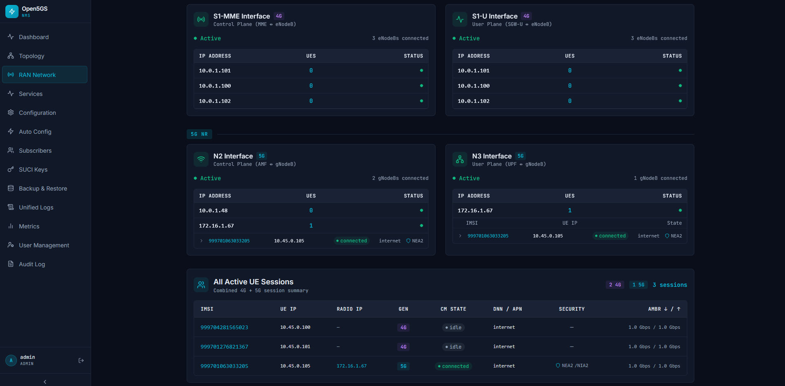

### Network Topology Visualization
- **Interactive Diagram** - JointJS-based professional network topology
- **Real-Time Status** - Color-coded service indicators (green=active, red=inactive)
- **5G Radio Network Status box** — live N2 and N3 gNodeB IPs on the topology canvas
- **Active 5G UE Sessions box** — UE IP + IMSI pairs sourced from Open5GS AMF/SMF APIs
- **Active 4G UE Sessions box** — UE IP + IMSI pairs sourced from Open5GS MME API
- **Professional Layout** - Manual routing with 90-degree orthogonal connectors


### Service Management
- **Real-Time Monitoring** — WebSocket-based live status cards for all 17 NFs plus MongoDB
- **Systemd Integration** — Start, stop, restart, enable and disable services directly from the UI
- **Bulk Operations** — Control all services at once in correct dependency order
- **MongoDB tracking** — MongoDB included as a first-class service with status indicator on topology

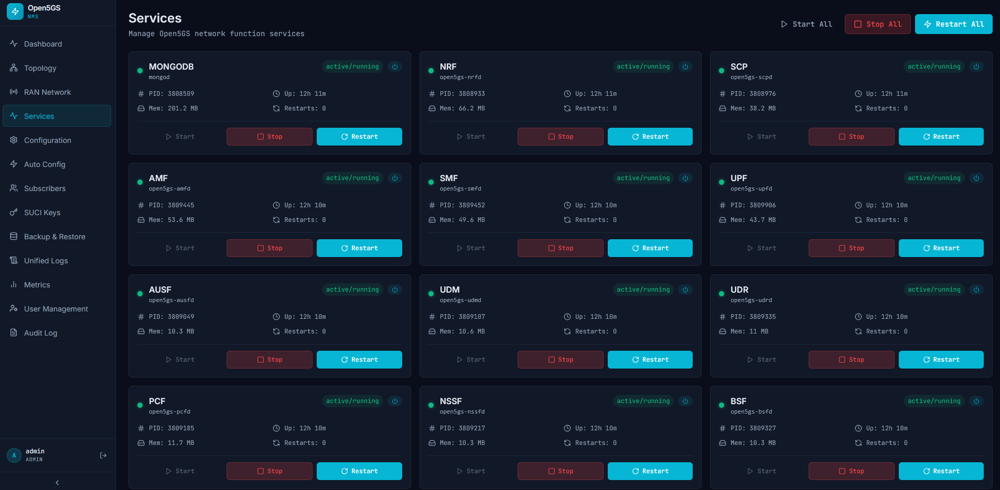

### Auto-Configuration Wizard
- **One-Click Setup** — Generate all 16 NF configurations from minimal input (PLMN, host IPs, UE subnets)
- **Preview Changes** — YAML diff viewer shows exact changes before applying
- **Persistent NAT** — iptables rules saved via `netfilter-persistent` and IP forwarding via `sysctl.d` — survive reboots


### Backup & Restore
- **Automatic Backups** — Created before every configuration change; configurable retention policy
- **Selective Restore** — Restore config only, database only, both, or specific NFs
- **Rollback Protection** — Automatic restore on service restart failure
- **Diff Viewer** — Compare any backup against current config before restoring
- **Factory Defaults** — One-click restore to stock Open5GS configuration


### Femtocell Provisioning (Sercomm SCE4255W)
- **Auto-credential derivation** — derives root SSH and WebUI passwords from MAC address using the calc_f2 algorithm
- **Auto-config pull** — detects if WebUI is already enabled and pulls current config into the form automatically
- **Full provisioning** — enables WebUI via SSH if needed, applies all radio and core config, reboots device
- **CBRS Band 48 defaults** — pre-filled for dual-carrier deployment
- **MME IP auto-populated** from your Open5GS configuration
- **Browser geolocation** for SAS lat/long coordinates

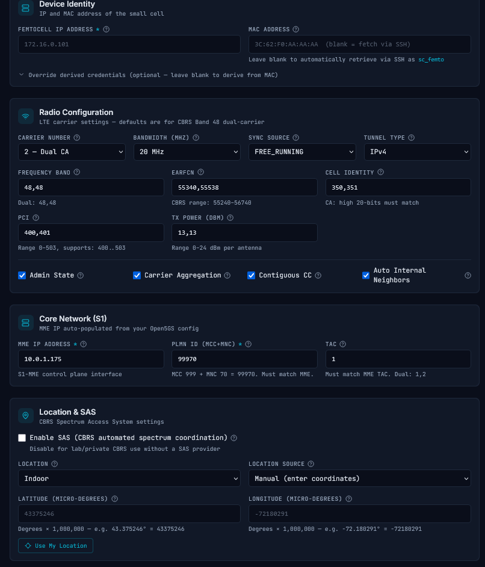

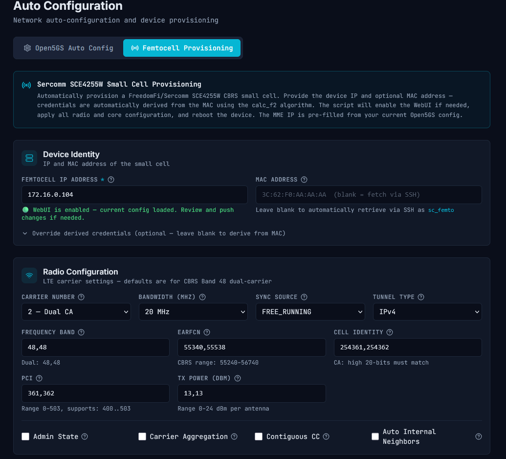

### CBRS SAS Server (Citizens Broadband Radio Service)
- **Built-in SAS** — Lab-only SAS-CBSD protocol emulator for controlled testing. Not an FCC-approved SAS and not suitable for live CBRS authorization. For live CBRS operation, CBSDs must obtain grants from an FCC-approved SAS Administrator.
- **Multi-radio support** — deterministic per-CBSD channel assignment based on serial number sort order; race-condition-proof, survives re-registrations and Clear DB cycles
- **Interference coordination groups** — radios in the same group are automatically spread across non-overlapping 20 MHz slots
- **Multi-band support** — configure multiple frequency bands to serve different radio types (e.g. Baicells on 3560–3620 MHz, Sercomm on 3649–3700 MHz)
- **Band Assignment** — three-level band policy: per-CBSD override > interference group assignment > global default; pins specific radios or entire groups to specific frequency ranges
- **Unified spectrum view** — all radios and bands shown on a single 3550–3700 MHz plot alongside per-band detail charts
- **Multi-site scaling** — independent slot assignment per interference group; two sites can reuse the same frequencies without conflict
- **Spectrum chart** — visual frequency band display with color-coded slots, EARFCN labels, and per-CBSD assignment table
- **GPS delay enforcement** — configurable lock delay (default 75 s) before grants are issued, ensuring radios are GPS-locked before transmitting
- **Pause / Resume** — instantly stops all SAS responses (radios return DEREGISTER and go silent) without deleting any data
- **Clear DB** — wipes all grants and CBSDs in one click for testing; radios re-register and get fresh deterministic slot assignments on reboot
- **CBRS SAS protocol** — implements the WInnForum CBRS SAS-CBSD interface (registration, spectrumInquiry, grant, heartbeat, relinquishment, deregistration)
- **HTTPS SAS endpoint** — TLS endpoint on port 8443 with auto-generated self-signed certificate; required for Sercomm radios which mandate HTTPS
- **Sercomm SCE4255W full integration** — complete SAS parameter provisioning via GenieACS TR-069 including Method, Category, ChannelType, HeightType, ManufacturerPrefix, CPI settings, lat/long in microdegrees
- **Baicells TR-069 integration** — full SAS parameter provisioning via GenieACS ACS on the Baicells provisioning page
- **Quiet docker logs** — per-request SAS protocol noise suppressed; clean 30-second status summary printed to docker compose logs instead


### Baicells eNodeB Provisioning *(Beta)*
- **GenieACS TR-069 ACS integration** — radios register automatically via CWMP on port 7547
- **Live RF status** — per-radio status dot (green = RF on, amber = RF off, red = offline) with 30-second auto-refresh
- **Full config push** — all parameters sent in a single TR-069 session, followed by automatic reboot and RF enable
- **Editable confirm modal** — preview the exact GenieACS NBI API calls before anything is sent; edit the JSON if needed
- **Per-radio and global controls** — Enable RF, Disable RF, Reboot per radio; RF On All, RF Off All, Reboot All from the header
- **Auto-backup** — full device parameter snapshot saved to disk after every successful provision
- **Audit logging** — all provision, reboot, and RF actions logged
- **Tested on:** Baicells Nova 430i running BaiBLQ_3.0.12 firmware


### Sercomm 5G NR Provisioning (SCE5164-B48) *(Beta)*
- **Dedicated "Sercomm 5G" tab** in the Auto-Config page, alongside Open5GS/Femto(4G)/Baicells
- **Full CU/DU split provisioning** — gNB identity, NG/F1 interface addressing, cell config (PLMN, TAC, PCI, S-NSSAI), and TDD slot pattern configuration in one push
- **SAS integration** — CBRS parameters (FCC ID, category, GPS location, band) provisioned alongside the radio config
- **Tested on:** Sercomm SCE5164-B48 running RC5607@230707 firmware

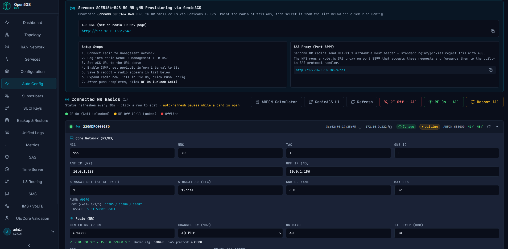

### SUCI Key Management (5G Privacy)
- **Keypair Generation** — Create X25519 (Profile A) or secp256r1 (Profile B) home network keys
- **Public Key Display** — Hex format ready for eSIM provisioning
- **pySIM JSON Generator** — One-click generation of correctly formatted `EF.SUCI_Calc_Info` JSON for pySIM-shell, in both pretty and single-line formats
- **Automatic Configuration** — Updates UDM config with new public key on generate/rotate
- **PKI Management** — Support for multiple PKI values (0–255) with next-ID auto-suggestion, rename without destroying keys

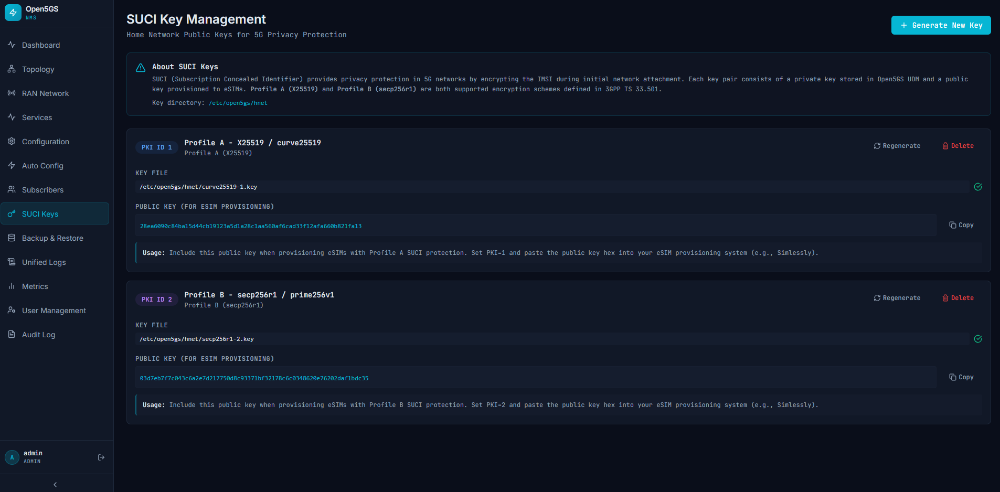


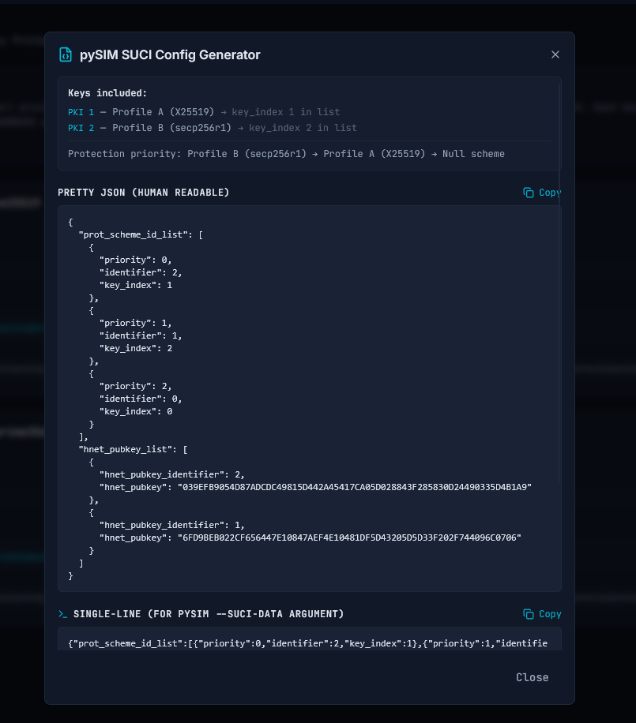

### Subscriber Management
- **Full CRUD Operations** - Create, read, update, delete subscribers via MongoDB
- **SIM Generator** - Generate test SIM credentials with country-based MCC selection (65+ countries)
- **Auto-Provisioning** - Automatically add generated SIMs to Open5GS database
- **Multi-Slice Support** - Configure multiple network slices and sessions per subscriber
- **Search & Pagination** - Efficient browsing of large subscriber databases
- **Subscriber Groups** — organize subscribers into named, colored groups (e.g. "Field trial A", "Test devices") for easier browsing of large deployments
- **Framed Routing** — configure IPv4/IPv6 subnets routed behind a UE per session (TS 23.501 §5.6.14, e.g. an IoT gateway's LAN); optional one-click static host route management, non-blocking overlap/duplicate warnings against other subscribers and the core UE pool, and a Framed Routes Registry view listing every configured subnet across all subscribers


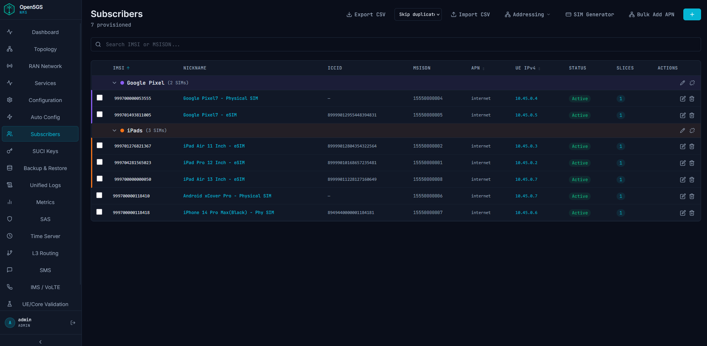


### Time Server (NTP via Chrony)
- **Chrony integration** — manages Chrony NTP daemon directly from the NMS; start, stop, restart, and configure without touching the CLI
- **Live tracking status** — reference server, stratum, system offset, RMS offset, frequency, root delay, update interval, and leap status all shown live
- **NTP server & pool management** — add, remove, and reorder upstream servers and pools with iburst/noselect flags
- **Allowed client networks** — configure which subnets can query the NTP server (critical for radios and UEs)
- **Advanced options** — makestep, maxdistance, and other Chrony directives exposed in the UI
- **Save & Restart** — writes `chrony.conf` and restarts the daemon in one click

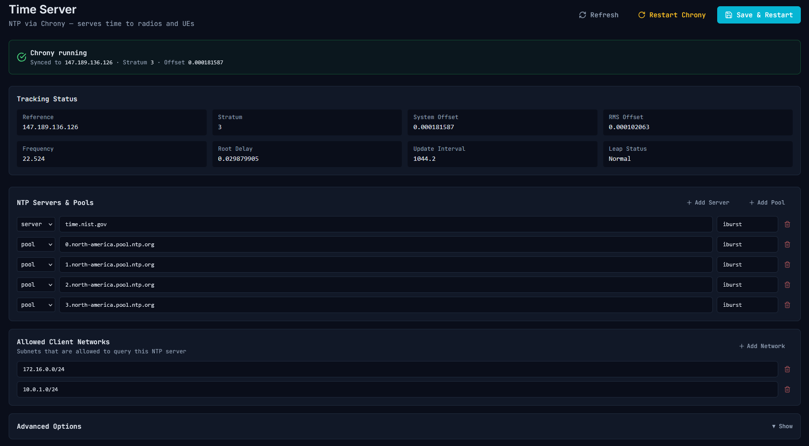

### FRR / L3 Routing
- **Layer 2 → Layer 3 migration wizard** — step-by-step guided migration from flat L2 service IPs to routed L3 using FRR + Virtual Service Interfaces (VSIs)
- **Multi-protocol support** — EIGRP, OSPF, and BGP; each protocol generates correct FRR config with appropriate neighbor/peer setup
- **Live Routing Status** — real-time neighbor status, EIGRP/OSPF/BGP topology table showing all prefixes, next-hops, interfaces, and metrics
- **Route Filters** — outbound and inbound prefix-list based filtering with Auto VSI filter button, preview, apply, and rollback
- **Active Configuration** — read-only summary of protocol, AS number, peer IP, and VSI mappings once migration is complete
- **Pre-flight checklist** — built-in requirements guide covering the 3 required interfaces, router-side prerequisites, and known FRR 8.4.x EIGRP limitations
- **Full rollback** — backup taken before any changes; rollback button restores previous state at any phase
- **Reinstall (Source)** — migrates FRR from the Ubuntu apt package (8.4.4, has long-standing eigrpd assertion-crash bugs) to a from-source build, with automatic backup, build, config-restore, and rollback
- **FRR log-level selector** — dropdown for FRR's 8 syslog severities (emergencies…debugging), applied via `vtysh -b` reload with no neighbor flap
- **TUN Interfaces & Dummy Interfaces** — now sub-tabs of this page (grouped alongside routing), instead of separate top-level nav items. TUN interfaces persist across reboots via systemd-networkd `.netdev`/`.network` files

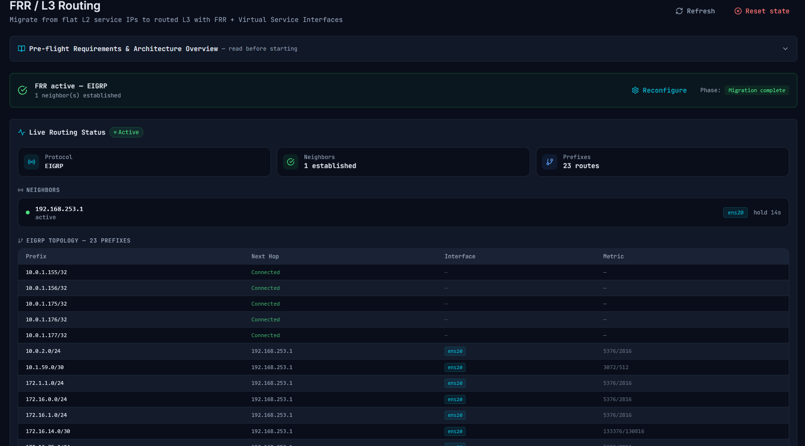

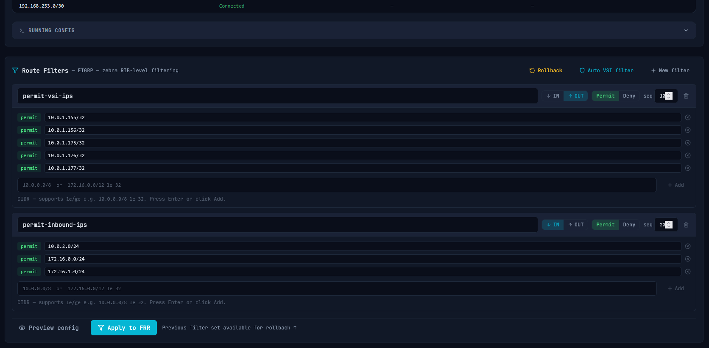

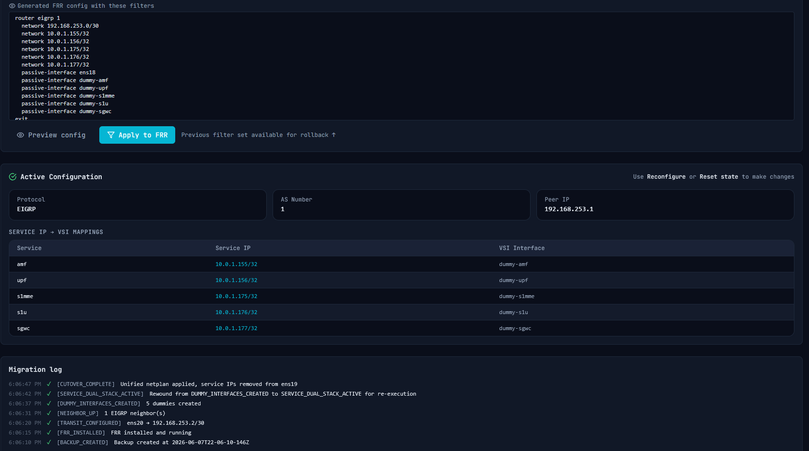

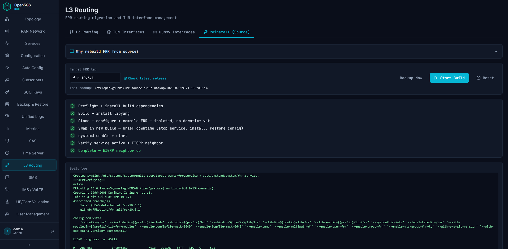

### SEPP / 5G Roaming (N32)
- **17th core NF** — SEPP (`open5gs-seppd`) gets its own Config tab alongside the other 16 NFs, included in the standard bulk Apply Config / backup / restart flow
- **Home SEPP configuration** — SBI server/client, N32-c and N32-f identity, scheme, address, and port
- **Optional TLS/mutual-TLS on N32** — toggle between plaintext HTTP and TLS; "Generate Certs" creates a self-signed keypair for your home SEPP and displays the public cert for handing to a visited-network operator; paste their public cert back in as the trusted peer CA
- **Generate Visited PLMN Config** — builds a complete, downloadable `sepp.yaml` for the visited operator from your already-configured home SEPP values, including your public cert when TLS is enabled

### DNS (BIND9) / FQDN Migration Wizard
- **BIND9 zone management** — dedicated "DNS (BIND9)" page for managing the DNS server backing your core's internal domain resolution
- **FQDN migration wizard** — converts the entire core from hardcoded IP addressing to 3GPP FQDN/DNS addressing (`5gc.mnc<mnc>.mcc<mcc>.3gppnetwork.org` for SBI, `epc.mnc<mnc>.mcc<mcc>.3gppnetwork.org` for the EPC Diameter mesh), matching carrier-grade deployment conventions and Open5GS's own roaming tutorial
- **Phased, reversible** — Phase A (DNS zones only), Phase B (EPC/Diameter mesh), Phase C (5G SBI mesh); a fresh backup is taken before B/C and rollback stays available as long as it exists
- **SEPP-aware** — includes SEPP's local SBI client in the FQDN scheme (its N32 peer to the visited PLMN is deliberately excluded — that's a different operator's DNS, not something local zone management can resolve)

### Real-Time Logging
- **Four log sources** — Open5GS systemd services, Docker containers, GenieACS access logs, and FRR, all streamed live via WebSocket
- **Live Log Streaming** — Tail logs from any service, with multi-select service/container filtering
- **Major Events view** — a filtered timeline of just the meaningful transitions (radio connect/disconnect, 4G attach/detach, 5G register/deregister, PDU session up/down) instead of raw DEBUG noise, across all 16 NF streams at once. Filter by event type, radio, and IMSI; click any event to open a zoomable log-context viewer showing the surrounding raw lines
- **Syslog Forwarding** — forwards all Open5GS, GenieACS, and FRR logs to a remote syslog server (e.g. Graylog) via rsyslog. Detects/installs rsyslog automatically, writes a dedicated drop-in config that never touches your existing rsyslog setup, and self-heals the AppArmor and file-permission issues that otherwise silently block it
- **Log Download & Debug Bundle** — download raw logs by service/date range, or a one-click debug bundle for bug reports


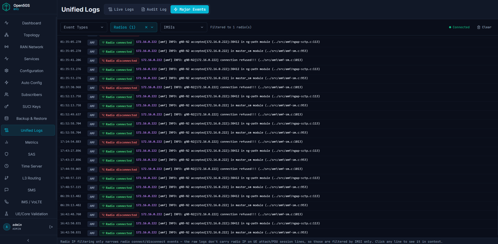

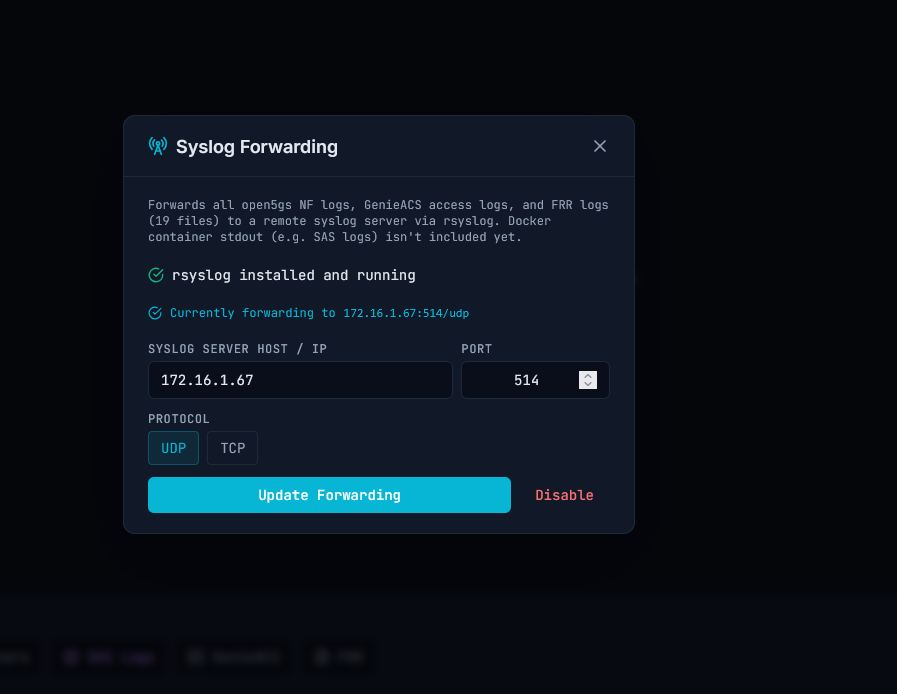

### IMS / VoLTE *(Alpha — Not Production-Ready)*

> ⚠️ **This module is in early alpha testing.** Server-side IMS signaling has been verified with a third-party SIP client, but end-to-end VoLTE on real phones is not confirmed working, and will likely require manual configuration beyond what this page automates (device/carrier-specific IMS provisioning, auth scheme adjustments, etc.). Do not rely on this for a production voice deployment.

- **Full IMS core integration** — P-CSCF/I-CSCF/S-CSCF (Kamailio 5.8.8, built with IMS/TLS/MySQL/extra modules), PyHSS Diameter HSS, BIND9 DNS, RTPEngine, MariaDB
- **One-click install** of every IMS component, including PyHSS ([nickvsnetworking/pyhss](https://github.com/nickvsnetworking/pyhss)), cloned and set up automatically — no separate manual install required
- **Guided configuration** — wires the P-CSCF address into SMF's PCO and per-session DNS, writes the Cx/Rx Diameter peer XML, and generates the IMS DNS zone automatically
- **Subscriber sync** — pushes IMPI/IMPU identities for your existing subscribers into PyHSS's HSS database
- **Server-side signaling verified** — all Diameter connections established, IMS APN and P-CSCF delivery confirmed working end-to-end with a third-party SIP client (Linphone) over Early-IMS auth
- **Known limitation** — Android's telephony framework suppresses VoLTE/SIP REGISTER on test PLMNs (MCC 999); this is a device/carrier-policy limitation, not a server-side issue

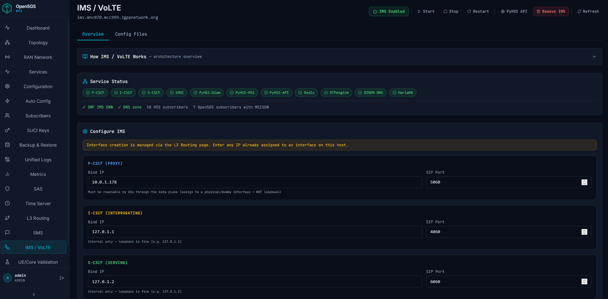

### SMS over SGs *(Beta)*
- **Osmocom CS-fallback SMS stack** — `osmo-stp` + `osmo-hlr` + `osmo-msc`, connected to the MME via the SGs interface, for SMS delivery without any IMS/VoLTE deployment
- **One-click install** — packages, service lifecycle (start/stop/restart/enable/disable), and subscriber sync all from the UI
- **Config file editor** — Monaco-based editor for all three Osmocom `.cfg` files with per-file save and save-and-restart
- **Architecture panel** — built-in diagram explaining how SMS over SGsAP works, right on the page
- Requires a combined EPS/IMSI attach from the UE

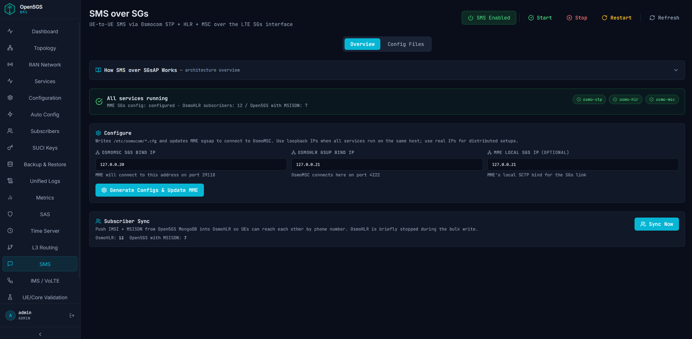

### VoWiFi *(Alpha — Highly Experimental, Not Production-Ready)*

> ⚠️ **This module is more experimental than IMS/VoLTE.** It was proven working end-to-end against a test IKEv2/EAP-AKA emulator (real SWx/S6b/GTP-C signaling, a real subscriber, a real static-IP assignment, EAP-AKA authentication succeeding), but a real handset has not been confirmed working. Do not rely on this for a production voice deployment.

- **osmo-epdg + strongSwan ePDG** — one-click install, configure, and lifecycle management from the UI
- **Config file editor** — Monaco-based editor for the ePDG config with save and save-and-restart
- **Upstream bug fixes carried forward** — two real bugs found and patched in `osmo-epdg` during testing (a silently-dropped HSS-assigned static IP, and an oversized GTP hash-table size a real Linux kernel's GTP driver rejects); a "Reload GTP Module" button is available if a tunnel ever gets stuck
- **Requires manual DNS/ePDG discovery setup** beyond what this page automates for real handsets — see [docs/features.md](docs/features.md) for details

### UE Validation *(Beta)*
- **Simulated test UEs** — spin up a 4G (srsRAN) or 5G (UERANSIM) test UE against your live core, no physical radio needed
- **End-to-end validation** — confirms attach, PDU session establishment, and idle-mode paging/wake all the way down to actual bidirectional traffic
- **Live log tailing & raw log download**, with session state that survives an NMS backend restart
- **Known limitation** — 5G idle-mode paging is unconfirmed (UERANSIM's simulated gNB may not implement an inactivity timer the way a real eNB does); 4G is fully verified end-to-end, 5G connected-state reachability is fully verified

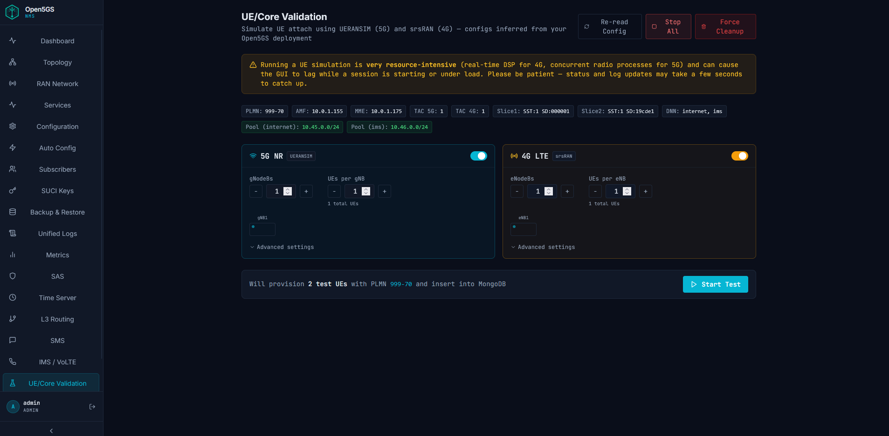

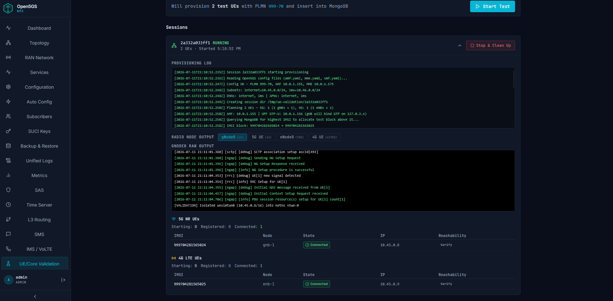

---

## 🚀 Quick Start

### Prerequisites

- **Ubuntu 24.04 LTS** (or compatible Linux distribution)
- **Open5GS 2.7+** installed and configured
- **MongoDB 6.0+** running on localhost
- **Docker Engine 24.0+** and **Docker Compose v2.20+**

> Optional modules (IMS/VoLTE, SMS over SGs, FRR-from-source, Syslog Forwarding) install their own additional host packages on first use, directly from their respective pages — see **[docs/requirements.md](docs/requirements.md#software-requirements)** for the full list before enabling them.

### Installation

```bash
# Clone the repository
git clone https://github.com/paulmataruso/open5gs-nms
cd open5gs-nms

# Configure environment (required — see Authentication section below)
cp .env.example .env
nano .env

# Build and start all services
docker compose up --build -d

# Access the web interface
open http://YOUR_SERVER_IP:8888
```

For detailed installation instructions, see **[INSTALL.md](INSTALL.md)**.

---

## 🔐 Authentication

### First Login

On first startup, an admin account is created automatically.

**Option A — Set your own password (recommended):**

Add this to your `.env` before running `docker compose up`:

```bash
FIRST_RUN_PASSWORD=your-secure-password-here
```

Then log in with username `admin` and the password you set. Clear `FIRST_RUN_PASSWORD` from `.env` after your first login.

**Option B — Auto-generated password:**

Leave `FIRST_RUN_PASSWORD` empty. A random password is generated and printed once to the container logs:

```bash
docker logs open5gs-nms-backend 2>&1 | grep -A4 "FIRST RUN"
```

Expected output:
```
════════════════════════════════════════════════════
  FIRST RUN — Admin account created
  Username : admin
  Password : Xk7mQ2pL9nRv4wYa
  Change this password after first login!
════════════════════════════════════════════════════
```

> **Missed the password?** Delete the auth database and restart:
> ```bash
> docker compose down && rm -f ./data/auth.db && docker compose up -d
> ```

### Auth Configuration

| Variable | Default | Description |
|----------|---------|-------------|
| `FIRST_RUN_PASSWORD` | *(empty)* | Initial admin password. Auto-generated if empty. Clear after first login. |
| `SESSION_MAX_AGE` | `86400` | Session lifetime in seconds (default: 24 hours) |
| `COOKIE_SECURE` | `false` | Set to `true` **only** when serving over HTTPS. Setting this to `true` on plain HTTP silently breaks login. |
| `AUTH_DB_PATH` | `/app/data/auth.db` | Path to SQLite auth database inside container. Must match the `./data:/app/data` volume mount. |

### HTTPS Deployments

When running behind HTTPS (nginx + SSL), set `COOKIE_SECURE=true` in `.env`:

```bash
COOKIE_SECURE=true
```

See **[docs/deployment.md](docs/deployment.md)** for full nginx SSL configuration.

---

## 📋 System Requirements

### Minimum
- **CPU:** 2 cores
- **RAM:** 4GB
- **Disk:** 20GB free space

### Recommended
- **CPU:** 4 cores
- **RAM:** 8GB
- **Disk:** 50GB free space (for logs and backups)

### Network
- Static IP address or DHCP reservation recommended
- Port 8888 for web interface
- Internet access for Docker builds

For complete requirements, see **[docs/requirements.md](docs/requirements.md)**.

---

## 📖 Documentation

### Getting Started
- **[Installation Guide](INSTALL.md)** - Step-by-step installation instructions
- **[Configuration Guide](docs/configuration.md)** - Network function configuration reference

### User Guides
- **[Features Overview](docs/features.md)** - Detailed feature documentation
- **[Subscriber Management](docs/subscribers.md)** - Provisioning and SIM generation
- **[SUCI Key Management](docs/suci.md)** - 5G privacy configuration
- **[Backup & Restore](docs/backup.md)** - Data protection strategies

### Administration
- **[Deployment Guide](docs/deployment.md)** - Production deployment best practices
- **[Troubleshooting](docs/troubleshooting.md)** - Common issues and solutions
- **[API Reference](docs/api-reference.md)** - Backend REST API documentation

### Development
- **[Architecture](ARCHITECTURE.md)** - System design and component overview
- **[Development Guide](docs/development.md)** - Local development setup
- **[Contributing](CONTRIBUTING.md)** - How to contribute to the project

---

## 🏗️ Architecture

The Open5GS NMS follows a **Clean Architecture** pattern with clear separation of concerns:

```
┌─────────────────────────────────────────────────────────────┐
│  Browser (React 18 + TypeScript + JointJS)                  │
│  http://YOUR_SERVER:8888                                     │
└───────────────┬──────────────────┬──────────────────────────┘
                │ REST API         │ WebSocket
                ▼                  ▼
┌─────────────────────────────────────────────────────────────┐
│  nginx Reverse Proxy (Alpine)                                │
│  Proxies /api → backend:3001                                 │
│  Upgrades WebSocket → backend:3002                           │
└───────────────┬──────────────────┬──────────────────────────┘
                │                  │
                ▼                  ▼
┌─────────────────────────────────────────────────────────────┐
│  Backend (Node.js 20 + TypeScript + Express)                │
│  Clean Architecture: Domain → Application → Infrastructure   │
│  Auth: Lucia v3 sessions → SQLite (auth.db)                 │
│  Container: privileged, network_mode: host                   │
└─────┬──────────┬──────────┬───────────┬──────────────────┬─┘
      │          │          │           │                  │
      ▼          ▼          ▼           ▼                  ▼
 /etc/open5gs  systemd   MongoDB    auth.db           /var/log
 (bind mount)  (via dbus) (host:27017) (./data volume) (bind mount)
```

### Technology Stack

**Frontend:**
- React 18.2, TypeScript 5.3, Vite 5.0
- TailwindCSS 3.4, Zustand 4.4
- JointJS 3.7 (topology), Monaco Editor 4.6 (YAML)

**Backend:**
- Node.js 20 LTS, TypeScript 5.3, Express 4.18
- Lucia v3 (sessions), better-sqlite3 (auth DB), oslo (bcrypt)
- Zod 3.22 (validation), MongoDB Native Driver 6.3
- WebSocket (ws) 8.16, Pino 8.17 (logging)

**Infrastructure:**
- Docker + Docker Compose
- nginx (reverse proxy)
- systemd (service management)

For detailed architecture documentation, see **[ARCHITECTURE.md](ARCHITECTURE.md)**.

---

## 🔧 Configuration

The NMS is configured through environment variables. Copy `.env.example` to `.env` and customize:

```bash
# Authentication (review before first deploy)
FIRST_RUN_PASSWORD=your-password    # Initial admin password
SESSION_MAX_AGE=86400               # Session lifetime in seconds
COOKIE_SECURE=false                 # Set true only for HTTPS deployments

# Backend
PORT=3001
WS_PORT=3002
MONGODB_URI=mongodb://127.0.0.1:27017/open5gs
CONFIG_PATH=/etc/open5gs
LOG_LEVEL=info
HOST_SYSTEMCTL_PATH=/usr/bin/systemctl

# Simlessly eSIM API (Subscribers page — "Generate eSIM", optional)
SIMLESSLY_ACCESS_KEY=          # From your Simlessly account's Developer module
SIMLESSLY_SECRET_KEY=          # Same place — never commit real values
```

Default values work for most deployments. For production, see **[docs/deployment.md](docs/deployment.md)**.

### eSIM Generation (Simlessly)

The Subscribers page can generate real eSIM activation codes via the
[Simlessly](https://docs.simlessly.com) RSP platform's Single Generate AC API. This
requires `SIMLESSLY_ACCESS_KEY`/`SIMLESSLY_SECRET_KEY` — obtained by logging into your
own Simlessly account's Developer module. Without them, the JSON preview/copy still
works, but "Generate via Simlessly API" will return an error. See
**[docs/features.md](docs/features.md#esim-generator-simlessly-api)** for details.

---

## 🛡️ Security

### What's protected
- All API endpoints require a valid session cookie
- Login is rate-limited (10 attempts / 15 min per IP)
- Passwords are bcrypt-hashed
- Session cookies are HttpOnly (not accessible to JavaScript)
- Auth data is stored in a separate SQLite database — the Open5GS MongoDB is never touched for auth

### Production recommendations

1. **Enable HTTPS** — Configure nginx SSL termination (Let's Encrypt) and set `COOKIE_SECURE=true` in `.env`
2. **Network restrictions** — Deploy behind a VPN or firewall for internet-exposed instances
3. **Regular backups** — Automate backup jobs and store copies off-site
4. **Monitoring** — Set up external monitoring (Prometheus, Grafana)

See **[docs/deployment.md](docs/deployment.md)** for detailed hardening guidance.

---

## 🤝 Contributing

We welcome contributions! Whether it's bug reports, feature requests, or code contributions, please see our **[Contributing Guide](CONTRIBUTING.md)**.

### Development Setup

```bash
# Clone repository
git clone https://github.com/paulmataruso/open5gs-nms
cd open5gs-nms

# Backend development
cd backend
npm install
npm run dev      # Runs on http://localhost:3001

# Frontend development (separate terminal)
cd frontend
npm install
npm run dev      # Runs on http://localhost:5173
```

For detailed development instructions, see **[docs/development.md](docs/development.md)**.

---

## 📝 Changelog

See **[CHANGELOG.md](CHANGELOG.md)** for a complete version history.

### Latest Release: v2.0-beta_0.9 (2026-07-16)

**🆕 New Modules: SEPP/N32 Roaming, DNS/FQDN Migration Wizard, VoWiFi, Framed Routing, eSIM Generator**
- **SEPP / 5G Roaming (N32)** — the 17th core NF now gets a full Config tab: home SEPP config, optional TLS/mutual-TLS with in-UI cert generation, and a "Generate Visited PLMN Config" export for the other operator
- **DNS (BIND9) / FQDN Migration Wizard** — phased, reversible migration of the whole core from hardcoded IPs to 3GPP FQDN/DNS addressing, plus a BIND9 zone management page
- **VoWiFi** *(alpha, highly experimental)* — osmo-epdg + strongSwan ePDG, proven working end-to-end against a test IKEv2/EAP-AKA emulator; real handsets unconfirmed
- **Framed Routing** — per-session IPv4/IPv6 subnets routed behind a UE, with optional static host route management, overlap/duplicate warnings, and a registry view
- **eSIM Generator** — generates real eSIM activation codes via the Simlessly RSP API from the Subscribers page

**🆕 Also since v2.0-beta_0.7: IMS/VoLTE, SMS over SGs, UE Validation, Subscriber Groups, Sercomm 5G NR**
- **IMS / VoLTE** *(alpha, not production-ready)* — full IMS core integration (Kamailio P/I/S-CSCF, PyHSS, BIND9, RTPEngine); server-side signaling verified with Linphone over Early-IMS auth, but real-phone VoLTE is unconfirmed and will likely need manual configuration
- **SMS over SGs** — Osmocom STP/HLR/MSC stack wired to the MME's SGs interface for CS-fallback SMS, no IMS required
- **UE Validation** — spin up simulated 4G (srsRAN) or 5G (UERANSIM) test UEs against your live core to validate attach/PDU/paging end-to-end without a physical radio
- **Subscriber Groups** — organize subscribers into named, colored groups on the Subscriber page
- **Sercomm 5G NR** — new "Sercomm 5G" Auto-Config tab for full SCE5164-B48 gNB provisioning

**🛠️ FRR / L3 Routing**
- **Reinstall (Source)** — migrates FRR from the Ubuntu apt package (8.4.4, long-standing eigrpd assertion-crash bugs) to a from-source build, fixing a real recurring issue where crash-looping briefly withdrew/relearned routes and caused intermittent S1AP/N2 drops across every connected radio
- **eigrpd crash-guard patch** — a hand-built patch on top of the from-source FRR build closing a long-standing upstream bug ([FRRouting/frr#943](https://github.com/FRRouting/frr/issues/943)) that could crash `eigrpd` entirely and drop every connected radio — see [docs/frr-eigrpd-crash-guard-patch.md](docs/frr-eigrpd-crash-guard-patch.md)
- FRR log-level selector (8 syslog severities) and a `frr.log` file, now wired in as a 4th Unified Logs source
- TUN Interfaces and Dummy Interfaces moved under the L3 Routing page as sub-tabs

**📜 Real-Time Logging**
- **Syslog Forwarding** — forwards all Open5GS/GenieACS/FRR logs to a remote syslog server (e.g. Graylog) via rsyslog, with automatic AppArmor and file-permission fixes so it works out of the box
- **Major Events view** — filtered timeline of just the meaningful transitions (radio connect/disconnect, attach/detach, register/deregister, PDU session up/down), filterable by event type/radio/IMSI, with a zoomable log-context viewer
- Log source switching now auto-selects that source's services

**⚠️ Known Issues**
- Subscriber Groups' mutating routes are missing `requireAdmin` (any authenticated user, not just admins, can currently manage groups)
- The backend's Docker socket mount changed from read-only to read-write — pending confirmation this is intentional
- SEPP and VoWiFi logs are not yet wired into Unified Logs / Major Events (still 16 NF streams there, not 17)

See **[CHANGELOG.md](CHANGELOG.md)** for the full history, including v2.0-beta_0.4–0.6 (security hardening, FRR route-filter fixes, TUN persistence, nav reorganization).

---

## 📄 License

Copyright (C) 2026 Paul Mataruso

This project is licensed under the **GNU Affero General Public License v3.0 (AGPL-3.0)** — see the [LICENSE](LICENSE) file for details.

In plain terms:
- You are free to use, modify, and distribute this software
- If you run a modified version on a server and users interact with it over a network, you must make your modified source code available to those users under the same license
- Commercial use requires either compliance with AGPL-3.0 or a separate commercial license agreement with the copyright holder

For commercial licensing inquiries, open an issue or discussion on [GitHub](https://github.com/paulmataruso/open5gs-nms).

---

## 🙏 Acknowledgments

- **[Open5GS Project](https://open5gs.org/)** - The open-source 5G Core and EPC implementation
- **[Lucia Auth](https://lucia-auth.com/)** - Session management library
- **[JointJS](https://www.jointjs.com/)** - Professional diagramming library
- **[React](https://reactjs.org/)** and **[TypeScript](https://www.typescriptlang.org/)** communities

---

## 📞 Support

- **Documentation:** [docs/](docs/)
- **Installation Issues:** [INSTALL.md](INSTALL.md) → [docs/troubleshooting.md](docs/troubleshooting.md)
- **Bug Reports:** [GitHub Issues](https://github.com/paulmataruso/open5gs-nms/issues)
- **Feature Requests:** [GitHub Issues](https://github.com/paulmataruso/open5gs-nms/issues)
- **Discussions:** [GitHub Discussions](https://github.com/paulmataruso/open5gs-nms/discussions)

---

**Built with ❤️ for the Open5GS community**
