# Open5GS Network Management System (NMS)

[](https://opensource.org/licenses/MIT)
[](https://www.docker.com/)
[](https://open5gs.org/)
[](https://nodejs.org/)
[](https://reactjs.org/)

Production-grade web-based management system for Open5GS 5G Core and 4G EPC networks. Provides complete configuration management, real-time monitoring, subscriber provisioning, and network visualization through an intuitive interface.

---

## 🎯 Overview

Open5GS NMS simplifies the management of Open5GS deployments by providing:

- **Complete Network Function Management** - Configure all 16 Open5GS network functions (5G Core + 4G EPC)
- **Visual Network Topology** - Interactive real-time visualization of your network infrastructure
- **Subscriber Management** - Full CRUD operations with SIM generator and auto-provisioning
- **Real-Time Monitoring** - Live service status, logs, and active session tracking
- **Safe Configuration** - Automatic backups, validation, and rollback on failure
- **5G Privacy (SUCI)** - Home network key management for subscription concealment

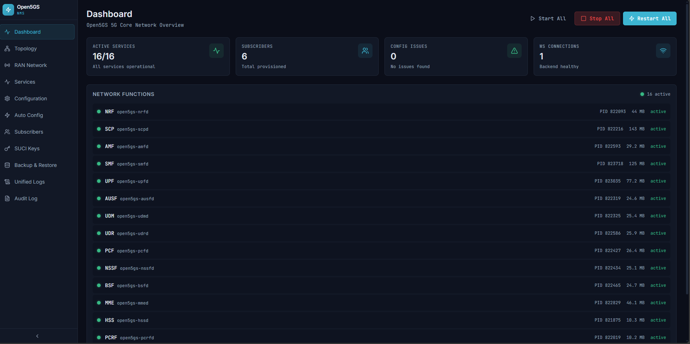

---

## ✨ Key Features

### Configuration Management
- **Dual Editor Modes** - Form-based editor with 150+ contextual tooltips OR Monaco YAML editor
- **All 16 Network Functions** - Complete coverage: NRF, SCP, AMF, SMF, UPF, AUSF, UDM, UDR, PCF, NSSF, BSF (5G) + MME, HSS, PCRF, SGW-C, SGW-U (4G)
- **Real-Time Validation** - Zod schema validation with cross-service dependency checking
- **Safe Apply Workflow** - Automatic backups, ordered service restarts, automatic rollback on failure
- **YAML Preservation** - Maintains comments, formatting, and structure

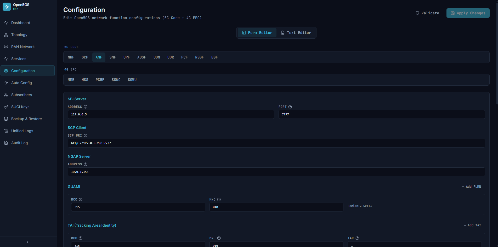

### Network Topology Visualization
- **Interactive Diagram** - JointJS-based professional network topology
- **Real-Time Status** - Color-coded service indicators (green=active, red=inactive)
- **Interface Monitoring** - S1-MME, S1-U, N2, N3 interface status with active connections
- **Active UE Sessions** - Live display of connected devices with IP-to-IMSI correlation
- **Professional Layout** - Manual routing with 90-degree orthogonal connectors

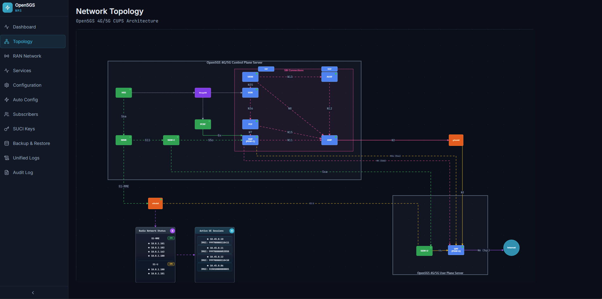

### Subscriber Management
- **Full CRUD Operations** - Create, read, update, delete subscribers via MongoDB
- **SIM Generator** - Generate test SIM credentials with country-based MCC selection (65+ countries)
- **Auto-Provisioning** - Automatically add generated SIMs to Open5GS database
- **Multi-Slice Support** - Configure multiple network slices and sessions per subscriber
- **Search & Pagination** - Efficient browsing of large subscriber databases

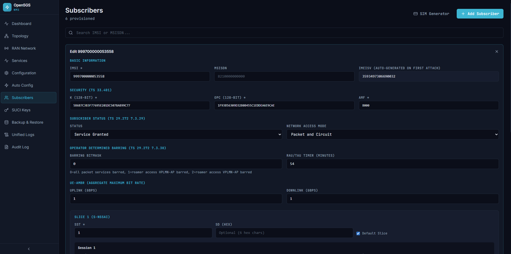

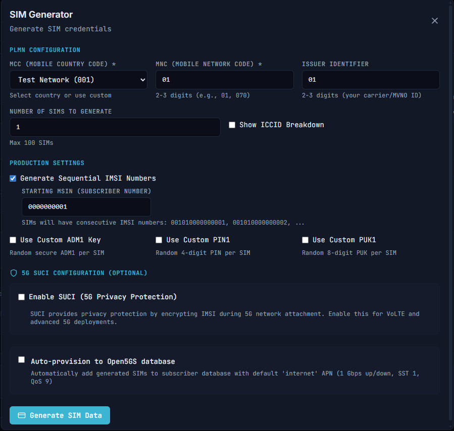

### SUCI Key Management (5G Privacy)
- **Keypair Generation** - Create X25519 (Profile A) or secp256r1 (Profile B) keys
- **Public Key Display** - Hex format ready for eSIM provisioning (Simlessly, etc.)
- **Automatic Configuration** - Updates UDM config with home network public key
- **PKI Management** - Support for multiple PKI values (0-255)

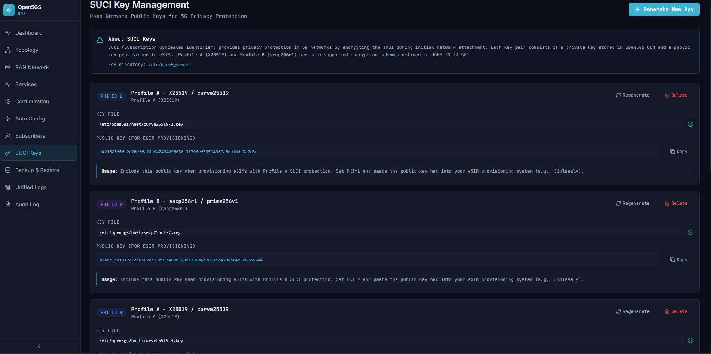

*Key generation modal with public key display:*

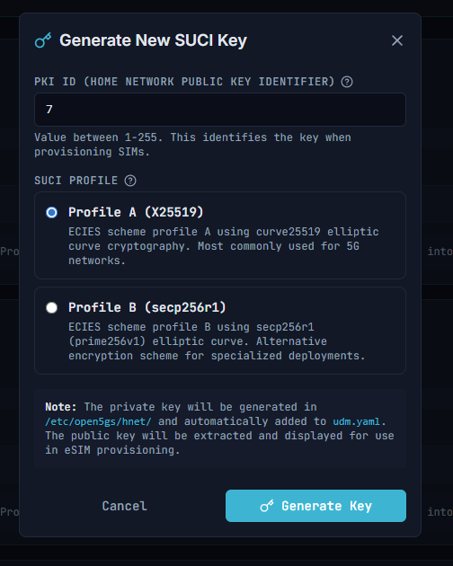

### Service Management
- **Real-Time Monitoring** - WebSocket-based live service status updates
- **Systemd Integration** - Start, stop, restart services directly from UI
- **Bulk Operations** - Control all services at once
- **Health Indicators** - Active/inactive status with uptime and resource usage
- **Dependency Awareness** - Services restart in correct order (NRF first, then dependencies)

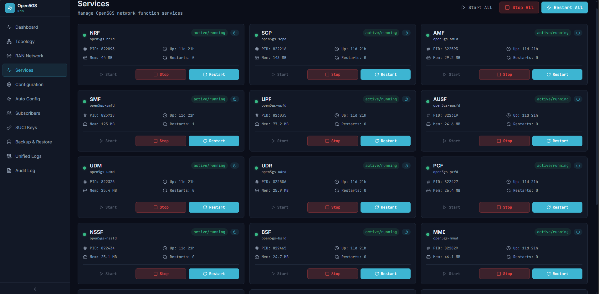

### Auto-Configuration Wizard
- **One-Click Setup** - Generate all 16 NF configurations from minimal input
- **Preview Changes** - YAML diff viewer shows exact changes before applying
- **Optional NAT** - Configure iptables rules for UE internet access
- **Smart Defaults** - Loads current Open5GS values as form defaults

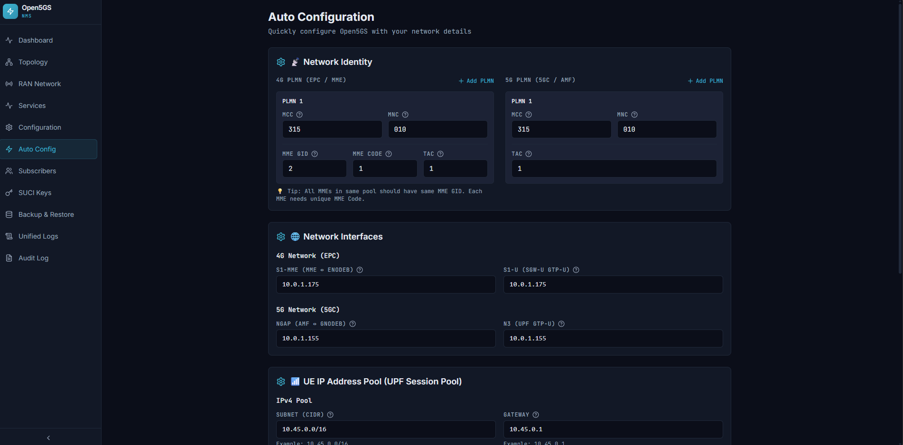

### Real-Time Logging
- **Live Log Streaming** - Tail logs from any service via WebSocket
- **Service Filtering** - View logs from individual network functions
- **Color-Coded Levels** - ERROR (red), WARN (yellow), INFO (blue)
- **Auto-Scroll Control** - Pause and resume log streaming

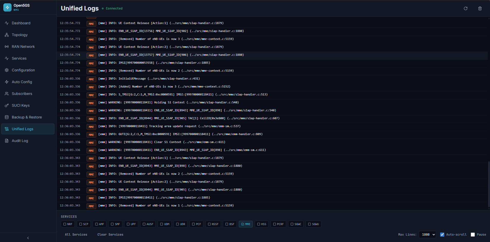

### Backup & Restore
- **Automatic Backups** - Created before every configuration change
- **Configuration Backups** - All 16 YAML files timestamped
- **MongoDB Backups** - Subscriber database dumps
- **Selective Restore** - Restore config only, database only, or both
- **Rollback Protection** - Automatic restore on service restart failure

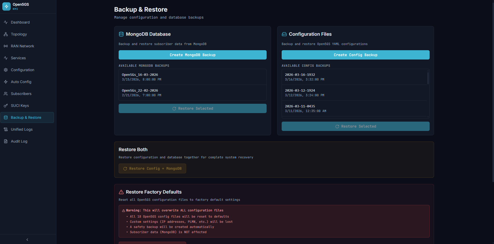

*Restore confirmation modal:*

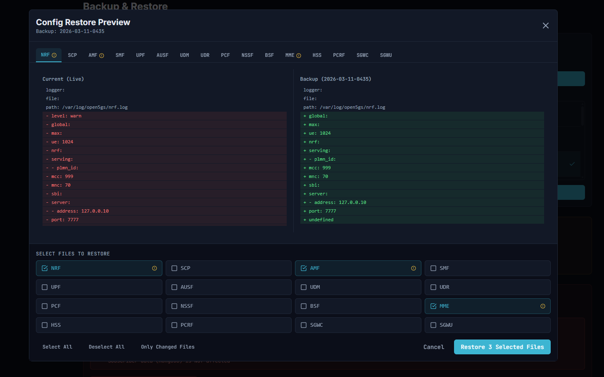

---

## 🚀 Quick Start

### Prerequisites

- **Ubuntu 24.04 LTS** (or compatible Linux distribution)
- **Open5GS 2.7+** installed and configured
- **MongoDB 6.0+** running on localhost
- **Docker Engine 24.0+** and **Docker Compose v2.20+**

### Installation

```bash
# Clone the repository
git clone https://github.com/YOUR_ORG/open5gs-nms.git
cd open5gs-nms

# Build and start all services
docker compose up --build -d

# Access the web interface
open http://YOUR_SERVER_IP:8888
```

That's it! The NMS is now running and ready to manage your Open5GS deployment.

For detailed installation instructions, see **[INSTALL.md](INSTALL.md)**.

---

## 📋 System Requirements

### Minimum
- **CPU:** 2 cores
- **RAM:** 4GB
- **Disk:** 20GB free space

### Recommended
- **CPU:** 4 cores
- **RAM:** 8GB
- **Disk:** 50GB free space (for logs and backups)

### Network
- Static IP address or DHCP reservation recommended
- Port 8888 for web interface
- Internet access for Docker builds

For complete requirements, see **[docs/requirements.md](docs/requirements.md)**.

---

## 📖 Documentation

### Getting Started
- **[Installation Guide](INSTALL.md)** - Step-by-step installation instructions
- **[Quick Start Tutorial](docs/quickstart.md)** - Get up and running in 10 minutes
- **[Configuration Guide](docs/configuration.md)** - Network function configuration reference

### User Guides
- **[Features Overview](docs/features.md)** - Detailed feature documentation
- **[Subscriber Management](docs/subscribers.md)** - Provisioning and SIM generation
- **[SUCI Key Management](docs/suci.md)** - 5G privacy configuration
- **[Backup & Restore](docs/backup.md)** - Data protection strategies

### Administration
- **[Deployment Guide](docs/deployment.md)** - Production deployment best practices
- **[Troubleshooting](docs/troubleshooting.md)** - Common issues and solutions
- **[API Reference](docs/api-reference.md)** - Backend REST API documentation

### Development
- **[Architecture](ARCHITECTURE.md)** - System design and component overview
- **[Development Guide](docs/development.md)** - Local development setup
- **[Contributing](CONTRIBUTING.md)** - How to contribute to the project

---

## 🏗️ Architecture

The Open5GS NMS follows a **Clean Architecture** pattern with clear separation of concerns:

```
┌─────────────────────────────────────────────────────────────┐
│  Browser (React 18 + TypeScript + JointJS)                  │
│  http://YOUR_SERVER:8888                                     │
└───────────────┬──────────────────┬──────────────────────────┘
                │ REST API         │ WebSocket
                ▼                  ▼
┌─────────────────────────────────────────────────────────────┐
│  nginx Reverse Proxy (Alpine)                                │
│  Proxies /api → backend:3001                                 │
│  Upgrades WebSocket → backend:3002                           │
└───────────────┬──────────────────┬──────────────────────────┘
                │                  │
                ▼                  ▼
┌─────────────────────────────────────────────────────────────┐
│  Backend (Node.js 20 + TypeScript + Express)                │
│  Clean Architecture: Domain → Application → Infrastructure   │
│  Container: privileged, network_mode: host                   │
└─────┬──────────┬──────────┬──────────────────────────────┬─┘
      │          │          │                              │
      ▼          ▼          ▼                              ▼
 /etc/open5gs  systemd   MongoDB                      /var/log
 (bind mount)  (via dbus) (host:27017)               (bind mount)
```

### Technology Stack

**Frontend:**
- React 18.2, TypeScript 5.3, Vite 5.0
- TailwindCSS 3.4, Zustand 4.4
- JointJS 3.7 (topology), Monaco Editor 4.6 (YAML)

**Backend:**
- Node.js 20 LTS, TypeScript 5.3, Express 4.18
- Zod 3.22 (validation), MongoDB Native Driver 6.3
- WebSocket (ws) 8.16, Pino 8.17 (logging)

**Infrastructure:**
- Docker + Docker Compose
- nginx (reverse proxy)
- systemd (service management)

For detailed architecture documentation, see **[ARCHITECTURE.md](ARCHITECTURE.md)**.

---

## 🔧 Configuration

The NMS is configured through environment variables. Copy `.env.example` to `.env` and customize:

```bash
# Backend
PORT=3001                                          # Backend API port
WS_PORT=3002                                       # WebSocket port
MONGODB_URI=mongodb://127.0.0.1:27017/open5gs     # MongoDB connection
CONFIG_PATH=/etc/open5gs                           # Open5GS config directory
BACKUP_PATH=/etc/open5gs/backups/config            # Config backup location
MONGO_BACKUP_PATH=/etc/open5gs/backups/mongodb     # MongoDB backup location
LOG_LEVEL=info                                     # Log level (debug, info, warn, error)

# Frontend (built into image at build time)
VITE_API_URL=                                      # Empty for relative URLs
VITE_WS_URL=                                       # Empty for relative URLs
```

Default values work for most deployments. For production, see **[docs/deployment.md](docs/deployment.md)**.

---

## 🛡️ Security Considerations

### Current Security Model

⚠️ **This is currently designed for trusted internal networks only.**

- **No Authentication** - No user login required
- **No HTTPS/WSS** - HTTP and WebSocket only
- **Privileged Container** - Backend requires elevated permissions for systemctl access

### Production Recommendations

For production deployments:

1. **Enable HTTPS** - Use nginx SSL termination with Let's Encrypt certificates
2. **Restrict Access** - Deploy behind VPN or firewall rules
3. **Regular Backups** - Implement automated backup strategy
4. **Monitoring** - Set up external monitoring (Prometheus, Grafana)

See **[docs/deployment.md](docs/deployment.md)** for detailed security hardening.

---

## 🤝 Contributing

We welcome contributions! Whether it's bug reports, feature requests, or code contributions, please see our **[Contributing Guide](CONTRIBUTING.md)**.

### Development Setup

```bash
# Clone repository
git clone https://github.com/YOUR_ORG/open5gs-nms.git
cd open5gs-nms

# Backend development
cd backend
npm install
npm run dev      # Runs on http://localhost:3001

# Frontend development (separate terminal)
cd frontend
npm install
npm run dev      # Runs on http://localhost:5173
```

For detailed development instructions, see **[docs/development.md](docs/development.md)**.

---

## 📝 Changelog

See **[CHANGELOG.md](CHANGELOG.md)** for a complete version history.

### Latest Release: v1.0.0 (2026-03-23)

**🎉 Initial Public Release**

Complete network management system with:
- All 16 network function configuration editors
- Real-time topology visualization
- Subscriber management with auto-provisioning
- SUCI key management for 5G privacy
- Safe configuration workflow with automatic backups
- Real-time monitoring and log streaming
- Comprehensive 150+ tooltip system

---

## 📄 License

This project is licensed under the **MIT License** - see the [LICENSE](LICENSE) file for details.

---

## 🙏 Acknowledgments

- **[Open5GS Project](https://open5gs.org/)** - The open-source 5G Core and EPC implementation
- **[JointJS](https://www.jointjs.com/)** - Professional diagramming library
- **[React](https://reactjs.org/)** and **[TypeScript](https://www.typescriptlang.org/)** communities

---

## 📞 Support

- **Documentation:** [docs/](docs/)
- **Installation Issues:** [INSTALL.md](INSTALL.md) → [docs/troubleshooting.md](docs/troubleshooting.md)
- **Bug Reports:** [GitHub Issues](https://github.com/YOUR_ORG/open5gs-nms/issues)
- **Feature Requests:** [GitHub Issues](https://github.com/YOUR_ORG/open5gs-nms/issues)
- **Discussions:** [GitHub Discussions](https://github.com/YOUR_ORG/open5gs-nms/discussions)

---

## ⭐ Star History

If you find this project useful, please consider giving it a star on GitHub!

---

**Built with ❤️ for the Open5GS community**
